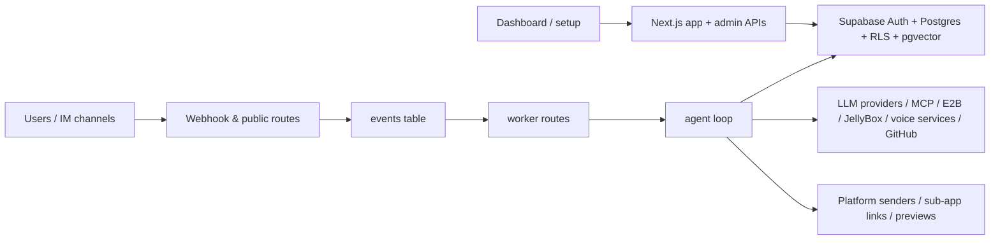

# SEAJelly

Serverless multi-channel AI agent platform with self-evolution built in.

Official domain: [seajelly.ai](https://seajelly.ai)

`SEAJelly` stands for **Self Evolution Agent Jelly**.

- `SEA` means **Self Evolution Agent** and also echoes the ocean-native, serverless philosophy of the product.
- `Jelly` matches the jellyfish mascot, the playful brand tone, and the current visual identity of the app.

> 中文说明: [README.zh-CN.md](./README.zh-CN.md)

[](https://vercel.com/new/clone?repository-url=https%3A%2F%2Fgithub.com%2Fseajelly-dev%2Fseajelly&env=NEXT_PUBLIC_SUPABASE_URL,NEXT_PUBLIC_SUPABASE_ANON_KEY,SUPABASE_SERVICE_ROLE_KEY,ENCRYPTION_KEY,NEXT_PUBLIC_APP_URL,CRON_SECRET&envDescription=Configure%20the%20required%20SEAJelly%20bootstrap%20environment%20variables%20before%20deploying.&envLink=https%3A%2F%2Fgithub.com%2Fseajelly-dev%2Fseajelly%2Fblob%2Fmain%2Fsetup.md)

## Why SEAJelly

The most distinctive part of SEAJelly is **self-evolution**.

SEAJelly is not only a chat agent platform. It can also read its own codebase, propose edits, push reviewed changes through GitHub, and watch Vercel deployments through its self-evolution pipeline. That loop is the sharp edge of the project and the reason the `SEA` name matters.

The behavior contract for that loop is documented in [skills/self-evolution-guide/SKILL.md](./skills/self-evolution-guide/SKILL.md). That guide matters because it gives a lightweight codebase a strong execution discipline: search first, propose before push, wait for approval, patch carefully, monitor deploys, and revert explicitly when needed. In practice, that kind of explicit workflow contract is what helps instruction-following stay reliable without turning the whole framework into a heavyweight orchestration system.

SEAJelly is for teams who want an agent platform that is:

- Serverless-first: no VPS, no Docker requirement, no always-on process
- Multi-channel: IM/webhook adapters feed a shared event and agent runtime
- Admin-friendly: setup wizard plus dashboard-managed secrets, models, agents, and tools
- Extensible: skills, MCP servers, coding tools, sub-apps, and storage integrations
- Data-aware: memories, vector knowledge base, event logs, usage analytics, and subscriptions

## Core Product Concepts

| Concept | Why it matters |
| --- | --- |
| `SEA` self-evolution | The project can evolve its own code through a review-first GitHub/Vercel loop, guided by the self-evolution skill contract. |
| LLM load balancing | Provider keys are stored as a weighted key pool with per-key call counts and automatic cooldown when keys hit rate limits or overload. This is designed for higher concurrency and better resilience than a single-key setup. |
| Sub-Apps | Sub-Apps are agent-native GUI applications, not just links or embedded forms. They let agents create real browser experiences with bearer-link access and private server-side data boundaries. |
| Agent subscriptions | The subscription system is an early "OnlyFans for agents" prototype: creators can run paid agents with trial messages, approvals, Stripe payment links, and per-channel subscriptions. |
| Sandboxes plus scheduling | SEAJelly combines secure E2B code sandboxes with scheduled agent invocations and reminders via `pg_cron`, so agents can both execute work and schedule future work. |

## One-Click Deploy

The Vercel button above opens Vercel's import flow and lets a user create their own deployment from this repository with minimal manual setup.

For a beginner-friendly walkthrough, use:

- English: [setup.md](./setup.md)
- Chinese: [setup.zh-CN.md](./setup.zh-CN.md)

Typical flow:

1. Click `Deploy with Vercel`.
2. Fill in the bootstrap environment variables listed below, especially `SUPABASE_SERVICE_ROLE_KEY`.
3. Finish the deployment.
4. Open `/setup`.
5. Follow the detailed setup guide.

If your users are mainly in mainland China, bind a custom domain instead of relying on `*.vercel.app`.

## Local Development

```bash
git clone https://github.com/seajelly-dev/seajelly.git
cd seajelly
pnpm install
cp .env.example .env.local
pnpm dev
```

Open [http://localhost:3000](http://localhost:3000), then visit `/setup`.

## Minimal Environment Variables

Most runtime secrets are designed to be entered in `/setup` or the dashboard and stored encrypted in Supabase. For local development or first deployment, you still need the bootstrap environment below:

| Variable | Required | Purpose |
| --- | --- | --- |
| `NEXT_PUBLIC_SUPABASE_URL` | Yes | Supabase project URL |
| `NEXT_PUBLIC_SUPABASE_ANON_KEY` | Yes | Browser/server session client |
| `SUPABASE_SERVICE_ROLE_KEY` | Yes | Required before `/setup` can continue, and used for strict server-side access and security-sensitive routes |
| `ENCRYPTION_KEY` | Yes | AES-256-GCM key for encrypting stored secrets |
| `NEXT_PUBLIC_APP_URL` | Yes | Public base URL used by webhook, preview, cron, and voice-link flows |
| `CRON_SECRET` | Yes | Protects worker and agent invocation endpoints |

Generate secrets with:

```bash
openssl rand -base64 32
```

Important:

- `NEXT_PUBLIC_APP_URL` must be publicly reachable from Supabase if you use `pg_cron`, webhook callbacks, previews, or voice temp links.
- For local webhook or scheduled-task testing, use a tunnel such as ngrok or Cloudflare Tunnel instead of `localhost`.

## Setup Guide

README only keeps the short version. The detailed setup walkthrough lives here:

- English: [setup.md](./setup.md)
- Chinese: [setup.zh-CN.md](./setup.zh-CN.md)

In short, `/setup` does four things:

1. Connect Supabase with a PAT and project ref
2. Create the first admin account
3. Save at least one model provider key and optional embedding credentials
4. Create the first agent and optionally attach an IM platform

Setup now validates bootstrap deployment envs before running SQL. If something like `NEXT_PUBLIC_APP_URL` or `ENCRYPTION_KEY` is malformed, it will stop early and tell you to fix Vercel + redeploy first.

If setup shows a **security login URL** dialog at the end in production, save it immediately before confirming.

After that confirmation, setup now offers a second finish dialog with quick entry into either the dashboard or `Dashboard -> Updates`, where users can enable guided one-click upgrades.

The setup flow now supports refresh-safe resume in the same browser via a temporary HttpOnly cookie. If that cookie is lost, `/setup` will ask you to reconnect Supabase from step 1.

If Supabase email confirmation is still enabled during step 2, setup now rolls back the partial admin user instead of leaving the install stuck between steps.

## What Exists Today

| Area | Current scope |
| --- | --- |
| Self-evolution | GitHub/Vercel pipeline, self-evolution skill contract, review-first code change flow |
| Agent runtime | Multi-step agent loop, slash commands, toolkits, event queue, retries, tracing |
| LLM routing | Weighted multi-key provider pool, per-key usage tracking, automatic cooldown and failover behavior |
| Channels | Telegram, Feishu, WeCom, Slack, QQ Bot, WhatsApp |
| Knowledge | Knowledge bases, article chunking, vector search, image-media embedding search |
| Agent capabilities | Skills, MCP servers, model/provider management, scheduled tasks |
| Multimodal | TTS, live voice, ASR, image generation |
| Coding sandboxes | E2B sandbox execution, HTML preview, and agent-triggerable code workflows |
| Sub-apps | Agent-native GUI apps with bearer-link access, built-in realtime chat room, and private-data server pattern |
| Monetization | Subscription plans, channel subscriptions, approval fallback, Stripe webhook scaffolding |
| Scheduling | Reminders, agent-invoke tasks, worker queue processing, and cron-backed automation |
| Storage | JellyBox object storage management backed by Cloudflare R2-compatible storage |
| Managed updates | Guided one-click upgrade flow for Vercel clone installs, with release manifest checks, deploy monitoring, and optional DB follow-up |
| Operations | Dashboard analytics, events queue inspection, usage stats, and admin controls |

## Project Status

SEAJelly is in active development and still being hardened for public release.

- The core product is already feature-rich.
- The self-evolution path is implemented and central to the project direction.
- Public-route and security hardening work is still ongoing before broader exposure.

## Supported Providers And Channels

### Channels

- Telegram
- Feishu
- WeCom
- Slack
- QQ Bot
- WhatsApp

#### WeCom Integration Note

If you use a WeCom custom app on a serverless deployment such as Vercel, you will often also need an Edge Gateway with a fixed public IP to satisfy WeCom IP allowlists and related backend-only forwarding cases.

The root README intentionally keeps this high level:

- Configure the gateway URL and secret in `Settings -> Edge Gateway`
- Add the gateway's public IP to the WeCom admin allowlist
- For gateway install, `gateway.json` structure, systemd setup, and capability routing, read [tools/edge-gateway/README.md](./tools/edge-gateway/README.md)
- If you want to quickly inspect what the installer does, read [tools/edge-gateway/install.sh](./tools/edge-gateway/install.sh)

### Model providers

Built-in providers include:

- Anthropic
- OpenAI
- Google
- DeepSeek
- OpenAI-compatible providers such as Groq, OpenRouter, Zhipu AI, Moonshot, MiniMax, DashScope, SiliconFlow, and VolcEngine

## Architecture



### Core execution model

1. Incoming channel traffic lands on a webhook or public entry route.
2. The request is normalized and queued in `events`.
3. Worker routes claim pending events and run the agent loop.
4. The loop loads session context, memories, skills, MCP tools, and enabled built-in tools.
5. Replies, logs, usage data, and downstream side effects are persisted back to Supabase.

## Repository Map

| Path | What it owns |
| --- | --- |
| `src/app/(dashboard)` | Admin UI pages |
| `src/app/api/admin` | Admin-only APIs |
| `src/app/api/webhook` | Channel webhook entrypoints |
| `src/app/api/worker` | Queue and scheduler workers |
| `src/app/api/app` | Public bearer-link sub-app APIs |
| `src/app/api/voice` | Voice temp-link and config routes |
| `src/lib/agent` | Agent loop, commands, media handling, tools, toolkits |
| `src/lib/platform` | Channel adapters, senders, approval flows |
| `src/lib/supabase` | Auth/session middleware and admin helpers |
| `src/lib/security` | Login gate and SSRF/security utilities |
| `supabase/migrations/001_initial_schema.sql` | Canonical schema file in git |
| `skills/self-evolution-guide/SKILL.md` | Self-evolution workflow guide |

## Further Reading

- [setup.md](./setup.md): beginner-friendly setup walkthrough
- [tools/edge-gateway/README.md](./tools/edge-gateway/README.md): Edge Gateway install, `gateway.json` configuration, and capability manifest guide
- [src/lib/agent/README.md](./src/lib/agent/README.md): agent runtime architecture and tool development guide
- [src/lib/agent/tooling/README.md](./src/lib/agent/tooling/README.md): builtin toolkits, catalog, and runtime policy guide
- [src/app/api/app/README.md](./src/app/api/app/README.md): Sub-App backend and bearer-link security guide
- [skills/self-evolution-guide/SKILL.md](./skills/self-evolution-guide/SKILL.md): self-evolution workflow contract and coding discipline
- [AGENTS.md](./AGENTS.md): contributor rules, repo invariants, and safety boundaries

## Commands

```bash
pnpm dev
pnpm lint
pnpm test:unit
pnpm build
```

## Tech Stack

SEAJelly is built on a modern, robust open-source stack:

- **Framework**: [Next.js](https://nextjs.org/) (App Router), [React](https://react.dev/)
- **Database & Auth**: [Supabase](https://supabase.com/) (Postgres, pgvector, RLS)
- **AI Orchestration**: [Vercel AI SDK](https://sdk.vercel.ai/), [Model Context Protocol (MCP)](https://modelcontextprotocol.io/)
- **Execution**: [E2B](https://e2b.dev/) (Security Code Interpreters)
- **Styling**: [Tailwind CSS](https://tailwindcss.com/), [Shadcn UI](https://ui.shadcn.com/)
- **Icons**: [Lucide React](https://lucide.dev/)

## License

This project is licensed under the [MIT License](LICENSE).
