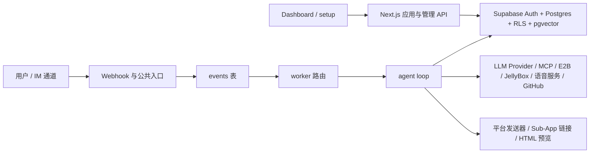

# SEAJelly

带有自进化能力的无服务器多通道 AI Agent 平台。

官方域名：[seajelly.ai](https://seajelly.ai)

`SEAJelly` 的名字来自 **Self Evolution Agent Jelly**。

- `SEA` 既是 **Self Evolution Agent** 的缩写，也呼应了这个产品面向 serverless、云原生与“海洋生态”式扩展的产品哲学。
- `Jelly` 则对应我们一直沿用的水母 / 果冻吉祥物、轻盈可爱的品牌气质，以及当前产品里的视觉形象。

> English: [README.md](./README.md)

[](https://vercel.com/new/clone?repository-url=https%3A%2F%2Fgithub.com%2Fshepherdwitty%2Fopencrab&env=NEXT_PUBLIC_SUPABASE_URL,NEXT_PUBLIC_SUPABASE_ANON_KEY,SUPABASE_SERVICE_ROLE_KEY,ENCRYPTION_KEY,NEXT_PUBLIC_APP_URL,CRON_SECRET&envDescription=%E8%AF%B7%E5%85%88%E9%85%8D%E7%BD%AE%20SEAJelly%20%E9%83%A8%E7%BD%B2%E6%89%80%E9%9C%80%E7%9A%84%E5%9F%BA%E7%A1%80%E7%8E%AF%E5%A2%83%E5%8F%98%E9%87%8F%E5%90%8E%E5%86%8D%E5%AE%8C%E6%88%90%E9%83%A8%E7%BD%B2%E3%80%82&envLink=https%3A%2F%2Fgithub.com%2Fshepherdwitty%2Fopencrab%2Fblob%2Fmain%2Fsetup.zh-CN.md)

## 为什么是 SEAJelly

SEAJelly 最迷人的部分，是它的**自进化能力**。

它不只是一个聊天 Agent 平台。SEAJelly 可以通过 GitHub 读取自己的代码、提出修改、在审阅后推送代码，并观察 Vercel 部署结果，形成“产品由 Agent 持续迭代自身”的闭环。这也是 `SEA` 这个名字真正有意义的地方。

而这条自进化链路的行为规范，已经写进了 [skills/self-evolution-guide/SKILL.md](./skills/self-evolution-guide/SKILL.md)。这个规范的意义不只是“多一份说明文档”，而是给一个轻量级框架加上了明确的执行纪律：先搜索理解、先提方案、等待确认、精确补丁、观察部署、必要时显式回滚。也正因为有这类明确的工作流约束，SEAJelly 不需要做成特别重的编排系统，也能在代码指令遵循上保持比较好的稳定性。

SEAJelly 适合希望用较低运维成本搭建 Agent 平台的团队或个人：

- 无服务器优先：不依赖 VPS，不要求 Docker，也不需要常驻进程
- 多通道接入：多个 IM / webhook 通道进入同一套事件队列和 Agent Runtime
- 管理面板完整：通过 setup 向导和 dashboard 管理密钥、模型、Agent 与工具
- 扩展方式丰富：支持 Skills、MCP、编码工具、Sub-App、对象存储
- 数据能力完整：记忆、向量知识库、事件日志、用量统计与订阅能力都已具备

## 核心产品概念

| 概念 | 为什么重要 |
| --- | --- |
| `SEA` 自进化 | 项目可以在审阅优先的 GitHub/Vercel 闭环里持续修改自身代码，而自进化 skill 负责把这件事约束成可执行、可复用、可审查的工作流。 |
| LLM 调用负载均衡 | Provider Key 不是单 key 直连，而是带权重的 key 池设计，记录每个 key 的调用量，并在限流或过载时自动进入冷却，适合更高并发和更强韧性的场景。 |
| Sub-App | Sub-App 是 Agent 原生的 GUI 应用，不只是发链接或表单。它让 Agent 能创建真正的浏览器交互界面，同时又保持业务数据走服务端私有边界。 |
| Agent 订阅 | 订阅系统是一个早期的“Agent 版 OnlyFans”原型：创作者可以做收费 Agent，支持试用次数、审批兜底、Stripe 支付链接和按用户通道计费。 |
| 沙盒 + 调度 | SEAJelly 把 E2B 安全代码沙盒与 `pg_cron` 调度能力组合在一起，既能执行代码工作，也能安排未来的自动任务。 |

## 一键部署

上面的 Vercel 按钮会打开 Vercel 的导入流程，普通用户可以比较轻松地从当前仓库创建属于自己的部署。

更适合小白的详细引导请看：

- English: [setup.md](./setup.md)
- 中文: [setup.zh-CN.md](./setup.zh-CN.md)

典型流程很简单：

1. 点击 `Deploy with Vercel`
2. 在 Vercel 里先填好下面列出的基础环境变量，尤其是 `SUPABASE_SERVICE_ROLE_KEY`
3. 完成部署
4. 打开 `/setup`
5. 按照详细 setup 文档一步步完成初始化

如果你的用户主要在中国大陆，建议绑定自定义域名，不要直接依赖 `*.vercel.app`。

## 本地开发

```bash
git clone https://github.com/shepherdwitty/opencrab.git
cd opencrab
pnpm install
cp .env.example .env.local
pnpm dev
```

打开 [http://localhost:3000](http://localhost:3000)，然后访问 `/setup`。

## 最小环境变量

大部分运行时密钥设计上是通过 `/setup` 或 Dashboard 写入 Supabase 并加密存储的。本地开发或首次部署时，仍然需要先准备下面这些基础环境变量：

| 变量名 | 是否必需 | 用途 |
| --- | --- | --- |
| `NEXT_PUBLIC_SUPABASE_URL` | 是 | Supabase 项目地址 |
| `NEXT_PUBLIC_SUPABASE_ANON_KEY` | 是 | 浏览器端与会话态服务端访问 |
| `SUPABASE_SERVICE_ROLE_KEY` | 必需 | `/setup` 继续之前必须先由部署环境提供，也用于严格服务端访问和安全敏感路由 |
| `ENCRYPTION_KEY` | 是 | 用于加密数据库中保存的密钥 |
| `NEXT_PUBLIC_APP_URL` | 是 | webhook、预览、cron、语音链接等流程使用的公开基地址 |
| `CRON_SECRET` | 是 | 保护 worker 与 agent 调用入口 |

可用以下命令生成随机密钥：

```bash
openssl rand -base64 32
```

注意：

- 如果你要测试 `pg_cron`、webhook、预览或语音临时链接，`NEXT_PUBLIC_APP_URL` 必须是 Supabase 可访问到的公网地址。
- 本地联调这类能力时，请使用 ngrok 或 Cloudflare Tunnel，不要直接使用 `localhost`。

## Setup 指南

README 里只保留简版说明，详细 setup 步骤请看：

- English: [setup.md](./setup.md)
- 中文: [setup.zh-CN.md](./setup.zh-CN.md)

简单来说，`/setup` 会完成四件事：

1. 用 Supabase PAT 和 project ref 连接项目
2. 创建首个管理员账号
3. 保存至少一个模型 Provider API Key，以及可选的 Embedding 凭证
4. 创建第一个 Agent，并按需绑定 IM 平台

如果你在生产环境 setup 结束时看到了**安全登录链接**提示，请立刻保存。

现在的 setup 支持在同一浏览器里刷新后续跑，依赖一个临时 HttpOnly cookie。若这个 cookie 丢失，`/setup` 会提示你回到第 1 步重新连接 Supabase。

## 当前已实现能力

| 领域 | 当前能力范围 |
| --- | --- |
| 自进化 | GitHub/Vercel 自演化流水线、自演化 skill 契约、审阅优先的代码变更流程 |
| Agent 运行时 | 多步 agent loop、命令系统、toolkit、事件队列、重试、trace |
| LLM 路由 | 带权重的多 key provider 池、单 key 调用统计、自动冷却与容错切换 |
| 消息通道 | Telegram、Feishu、WeCom、Slack、QQ Bot、WhatsApp |
| 知识系统 | 知识库、文章切块、向量检索、图片/媒体 embedding 检索 |
| Agent 能力扩展 | Skills、MCP Servers、模型/Provider 管理、定时任务 |
| 多模态 | TTS、实时语音、ASR、图片生成 |
| 编码沙盒 | E2B 沙盒执行、HTML 预览，以及可由 Agent 触发的代码工作流 |
| Sub-App | Agent 原生 GUI 应用、bearer-link 访问模型、内置实时聊天室与私有服务端访问模式 |
| 商业化 | 订阅套餐、用户通道订阅、审批兜底、Stripe webhook 基础链路 |
| 调度能力 | Reminder、agent invoke 任务、worker 队列处理与 cron 自动化 |
| 存储 | JellyBox 对象存储管理，兼容 Cloudflare R2 风格存储 |
| 运维 | Dashboard 统计、事件队列排障、usage 数据与后台控制能力 |

## 项目状态

SEAJelly 仍处于快速迭代和开源前加固阶段。

- 核心产品能力已经比较完整
- 自进化路径已经落地，而且是项目方向的核心
- 面向公网的大规模暴露前，安全边界仍在持续收敛

## 当前支持的通道与 Provider

### 消息通道

- Telegram
- Feishu
- WeCom
- Slack
- QQ Bot
- WhatsApp

#### WeCom 接入补充

如果你使用的是企业微信自建应用，并且部署形态是 Vercel 这类 Serverless 环境，通常还需要一个带固定公网 IP 的 Edge Gateway，来解决企微 API 白名单和部分后端转发场景。

根目录 README 只保留高层指引：

- 在 Dashboard 的 `Settings -> Edge Gateway` 中填写网关地址和密钥
- 将网关公网 IP 加入企业微信后台的 IP 白名单
- 网关的安装、`gateway.json` 配置、systemd 方式和能力声明，请直接深度阅读 [tools/edge-gateway/README.zh-CN.md](./tools/edge-gateway/README.zh-CN.md)
- 如果你想快速理解安装脚本会做什么，也可以直接查看 [tools/edge-gateway/install.sh](./tools/edge-gateway/install.sh)

### 模型 Provider

当前内置 Provider 包括：

- Anthropic
- OpenAI
- Google
- DeepSeek
- 一系列 OpenAI-compatible Provider，例如 Groq、OpenRouter、Zhipu AI、Moonshot、MiniMax、DashScope、SiliconFlow、VolcEngine

## 架构总览



### 核心执行路径

1. 来自 IM 或公网入口的请求进入 webhook / public route。
2. 请求被标准化后写入 `events` 队列。
3. Worker 领取 pending 事件并运行 agent loop。
4. Loop 加载 session、memory、skills、MCP 和启用的内置工具。
5. 回复、日志、用量统计以及其他副作用结果统一回写 Supabase。

## 仓库结构

| 路径 | 说明 |
| --- | --- |
| `src/app/(dashboard)` | 管理后台页面 |
| `src/app/api/admin` | 管理员 API |
| `src/app/api/webhook` | 各通道 webhook 入口 |
| `src/app/api/worker` | 队列和调度 worker |
| `src/app/api/app` | bearer-link 公共 Sub-App API |
| `src/app/api/voice` | 语音临时链接与配置接口 |
| `src/lib/agent` | Agent loop、commands、media、tools、toolkits |
| `src/lib/platform` | 各平台适配器、发送器、审批流 |
| `src/lib/supabase` | 鉴权中间件、admin/client helper |
| `src/lib/security` | 登录门禁与 SSRF / 安全工具 |
| `supabase/migrations/001_initial_schema.sql` | git 中的数据库 schema 源文件 |
| `skills/self-evolution-guide/SKILL.md` | 自进化工作流说明 |

## 延伸阅读

- [setup.zh-CN.md](./setup.zh-CN.md)：面向小白用户的 setup 详细指南
- [tools/edge-gateway/README.zh-CN.md](./tools/edge-gateway/README.zh-CN.md)：Edge Gateway 的安装、`gateway.json` 配置和能力声明说明
- [src/lib/agent/README.md](./src/lib/agent/README.md)：Agent 运行时架构与 tool 开发指南
- [src/lib/agent/tooling/README.md](./src/lib/agent/tooling/README.md)：内置 toolkit、catalog 与运行时策略说明
- [src/app/api/app/README.md](./src/app/api/app/README.md)：Sub-App 后端开发与 bearer-link 安全指南
- [skills/self-evolution-guide/SKILL.md](./skills/self-evolution-guide/SKILL.md)：自进化工作流契约与编码执行规范
- [AGENTS.md](./AGENTS.md)：贡献者协作约束、仓库不变量与安全边界

## 常用命令

```bash
pnpm dev
pnpm lint
pnpm test:unit
pnpm build
```

## 技术栈

SEAJelly 构建在现代且强大的开源技术栈之上：

- **框架**: [Next.js](https://nextjs.org/) (App Router), [React](https://react.dev/)
- **数据库与鉴权**: [Supabase](https://supabase.com/) (Postgres, pgvector, RLS)
- **AI 编排**: [Vercel AI SDK](https://sdk.vercel.ai/), [Model Context Protocol (MCP)](https://modelcontextprotocol.io/)
- **代码执行**: [E2B](https://e2b.dev/) (安全代码解释器)
- **样式方案**: [Tailwind CSS](https://tailwindcss.com/), [Shadcn UI](https://ui.shadcn.com/)
- **图标**: [Lucide React](https://lucide.dev/)

## 许可证

本项目采用 [MIT 许可证](LICENSE) 开源。
