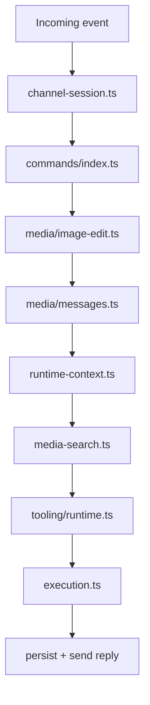

# Agent Development Guide

This document describes the recommended way to extend `src/lib/agent` without turning `loop.ts` back into a god file.

It is based on the current refactored architecture in this repository and focuses on one goal:

**make tools, toolkits, commands, and loop integrations composable and independently testable.**

## Scope

Use this guide when you need to:

- add or change a builtin/system tool
- add a toolkit that bundles multiple tools
- register a new slash-style command
- introduce a new pre-LLM or post-LLM runtime stage
- decide whether a change belongs in `loop.ts` or in a dedicated module

See also:

- `src/lib/agent/tooling/README.md` for toolkit-specific catalog/runtime details

## Design Principles

### 1. Keep `loop.ts` as the orchestrator

`src/lib/agent/loop.ts` should read like a pipeline, not like a storage adapter, MIME switchboard, tool registry, and command router mixed together.

The loop is allowed to:

- assemble high-level context
- call stage modules in order
- decide whether to continue, short-circuit, or persist results
- handle top-level errors and rate limiting

The loop should **not** own:

- command-specific business logic
- file download and MIME branching details
- channel/session query details
- tool policy text
- toolkit activation rules
- model execution edge-case policy

If a block has domain language of its own, it probably deserves a module.

### 2. Prefer typed stage boundaries

Each stage should accept a small input object and return a named result object.

Good examples in the current codebase:

- `resolveAgentRuntimeContext(...)`
- `buildInboundUserMessages(...)`
- `handlePendingImageEdit(...)`
- `runImageKnowledgeBypass(...)`
- `executeAgentRun(...)`
- `resolveAgentReply(...)`

This keeps module contracts stable even when internals evolve.

### 3. Keep tools atomic, even when the UI groups them

A **tool** is the smallest model-callable capability.

A **toolkit** is a code-owned bundle of tools with:

- grouped permission semantics
- shared policy text
- optional `generateText` focus rules
- UI metadata

Do not turn a multi-step workflow into one giant tool unless the model repeatedly fails with the atomic version and the wrapper meaningfully reduces risk.

### 4. Put policy close to runtime, not in prompts scattered across the loop

If a tool needs behavior constraints, those rules belong in:

- `src/lib/agent/tooling/runtime.ts`, or
- `src/lib/agent/tooling/toolkits/<name>.ts`

Do not hardcode tool instructions inside `loop.ts`.

### 5. Commands are not tools

Commands are explicit user control-plane actions such as `/start`, `/status`, `/imgedit`, and `/cancel`.

Tools are model-invoked capabilities such as `knowledge_search`, `run_sql`, or `github_patch_files`.

Keep these systems separate:

- commands live under `src/lib/agent/commands/`
- tools live in `src/lib/agent/tools.ts` and `src/lib/agent/tooling/`

## Current Architecture

```txt
src/lib/agent/
  loop.ts                    -> top-level orchestration
  channel-session.ts         -> channel/session lookup, creation, access checks
  runtime-context.ts         -> tool assembly, skills, memories, system prompt, MCP
  execution.ts               -> generateText execution, step handling, reply resolution
  media-search.ts            -> image knowledge bypass stage
  tools.ts                   -> builtin tools + sub-app tools
  commands/
    index.ts                 -> parseCommand + dispatchCommand
    handlers/*.ts            -> one file per command
  media/
    download.ts              -> file download abstraction
    messages.ts              -> user message construction
    image-edit.ts            -> pending image-edit intercept
  tooling/
    catalog.ts               -> client-safe tool/toolkit metadata
    runtime.ts               -> tool filtering, policy sections, tool directives
    registry.ts              -> toolkit runtime registry
    toolkits/*.ts            -> toolkit policies and activation rules
    tools/*.ts               -> extracted tool implementations by domain
```

## Integration Pipeline

This is the intended mental model for the main loop:



When adding new behavior, first decide **which stage owns it**.

## Where New Logic Should Go

### Add a builtin/system tool

Use this path when the model should call a capability directly.

Primary files:

- `src/lib/agent/tools.ts`
- `src/lib/agent/tooling/catalog.ts`
- `src/lib/agent/tooling/runtime.ts`

Recommended workflow:

1. Implement the tool in `createAgentTools(...)`.
2. If the implementation is large or domain-specific, extract it to `src/lib/agent/tooling/tools/<domain>.ts`.
3. Register the tool in `BUILTIN_TOOL_CATALOG` in `src/lib/agent/tooling/catalog.ts`.
4. If the tool requires special instructions, add policy in `src/lib/agent/tooling/runtime.ts`.
5. If the tool should be grouped with others in the UI, promote it into a toolkit instead of adding ad-hoc enablement logic.
6. Add or update focused unit tests.

Rules:

- Validate inputs with `zod`.
- Return structured results with `success` plus explicit payload or error fields.
- Keep audit/write-guard logic close to the tool implementation.
- Do not make `loop.ts` aware of the tool unless a brand-new pipeline stage is required.

### Add a toolkit

Use a toolkit when several tools should be enabled together and share operating rules.

Primary files:

- `src/lib/agent/tooling/catalog.ts`
- `src/lib/agent/tooling/toolkits/<name>.ts`
- `src/lib/agent/tooling/registry.ts`
- `src/lib/agent/tools.ts`

Recommended workflow:

1. Build the atomic member tools first.
2. Add toolkit metadata and member keys to `catalog.ts`.
3. Add a runtime definition in `toolkits/<name>.ts`.
4. Register that runtime definition in `registry.ts`.
5. Mount the member tools from `createAgentTools(...)`.
6. Put toolkit-specific prompt policy and `generateText` directives in the toolkit runtime file.

Toolkit responsibilities:

- permission grouping
- policy injection
- optional tool-focus / forced-tool behavior
- compatibility with legacy per-tool booleans

Toolkit responsibilities should **not** include:

- direct message orchestration
- session creation
- command routing
- hand-written special cases in `loop.ts`

### Add a slash command

Use this path when the user explicitly invokes a command rather than relying on the model.

Primary files:

- `src/lib/agent/commands/index.ts`
- `src/lib/agent/commands/types.ts`
- `src/lib/agent/commands/handlers/<command>.ts`

Recommended workflow:

1. Create one handler file per command.
2. Accept `CommandContext` and return `Promise<LoopResult | null>`.
3. Register the handler in `COMMAND_HANDLERS` inside `commands/index.ts`.
4. Keep parsing rules in `parseCommand(...)`, not in `loop.ts`.
5. Put command-specific storage or sender behavior inside the handler.

Command handlers should remain small enough to test without spinning up the entire loop.

### Add a new loop stage

Only do this when the behavior is cross-cutting and cannot cleanly fit into an existing stage.

Examples of valid new stages:

- a new normalization layer before messages reach the model
- a new retrieval pass that augments prompt context
- a post-execution analyzer that transforms model/tool output before reply resolution

Before editing `loop.ts`, ask:

1. Can this live inside `runtime-context.ts`?
2. Can this live inside `execution.ts`?
3. Can this live inside `media/`, `commands/`, or `channel-session.ts`?
4. Is this actually tool policy that belongs in `tooling/runtime.ts`?

If the answer is yes to any of the above, do not extend the loop directly.

## Tool–Loop Integration Contract

To keep future work componentized, use these rules when integrating tools with the loop.

### Tool availability is resolved before execution

Tool enablement belongs to `resolveAgentRuntimeContext(...)`, which already assembles:

- builtin tools
- toolkit filtering
- sub-app tools
- skill activation
- memory sections
- system prompt
- MCP connections

That means:

- do not re-check tool flags in `loop.ts`
- do not build tool policy strings in `loop.ts`
- do not partially assemble tool lists in multiple places

### Tool behavior steering belongs to `tooling/runtime.ts`

If the model needs guidance such as:

- “must call tool X for request Y”
- “disable tool X when image input is present”
- “restrict active tools for a specific intent”

put that in:

- `buildToolPolicySections(...)`, or
- `resolveGenerateTextToolDirective(...)`, or
- a toolkit runtime definition

This keeps tool-specific intelligence centralized and testable.

### Execution policy belongs to `execution.ts`

If the concern is about:

- `generateText` options
- step-limit behavior
- forced-tool-loop fallback text
- usage logging
- reply suppression after specific tool calls

put it in `src/lib/agent/execution.ts`, not in `loop.ts`.

### Cross-modal preprocessing belongs to `media/`

If a tool depends on image/file input, keep preprocessing in `src/lib/agent/media/` and pass normalized outputs forward.

The loop should consume:

- resolved file metadata
- normalized user messages
- optional warnings
- optional image-search payload

It should not manually branch on MIME types again.

## Recommended Coding Conventions

### Naming

Use naming that makes pipeline ownership obvious:

- `resolve*` for state/context assembly
- `build*` for derived prompts/messages/config
- `handle*` for interceptors or side-effecting branches
- `execute*` for model/tool runs
- `parse*` for syntax extraction

### Return shapes

Prefer explicit object returns over tuples or booleans.

Good:

```ts
return {
  userMessages,
  userWarning,
  imageBase64ForMediaSearch,
};
```

Avoid:

```ts
return [messages, warning, image];
```

### Error handling

- return honest, machine-readable tool errors
- keep non-blocking audit failures non-fatal where appropriate
- clean up timers/resources in `finally`
- let top-level retry/cooldown policy remain centralized

## Testing Strategy

Every new tool or loop-facing module should aim for focused unit tests before broader manual checks.

Minimum expectations:

- command parsing and dispatch for new commands
- success path for new tools
- at least one meaningful failure path
- policy/directive behavior if the tool changes tool selection
- result-shape tests for new loop stages

Good examples already in this folder:

- `src/lib/agent/commands/commands.test.ts`
- `src/lib/agent/channel-session.test.ts`
- `src/lib/agent/runtime-context.test.ts`
- `src/lib/agent/execution.test.ts`
- `src/lib/agent/media-search.test.ts`
- `src/lib/agent/media/media.test.ts`

Recommended verification checklist:

- `pnpm exec tsc --noEmit`
- `pnpm run lint`
- `pnpm run test:unit`
- a light manual pass for the user-facing path you changed

## Common Anti-Patterns

Avoid these unless there is a very strong reason:

- adding another long `if/else` branch directly into `loop.ts`
- mixing tool registration, policy, and execution in one file
- checking the same enablement rule in multiple layers
- building tool-specific prompts in command handlers
- letting a toolkit mutate unrelated session or channel state
- coupling MIME parsing to tool policy
- creating tools that both decide policy and perform orchestration side effects

## Pull Request Checklist

Before merging a tool or loop integration change, verify:

- the new behavior has a single clear home
- `loop.ts` only gained orchestration, not domain logic
- tool registration and policy changes live under `tooling/` or `tools.ts`
- command changes live under `commands/`
- new return types are named and testable
- failure behavior is covered, not only happy paths

## Quick Decision Table

| If you are adding... | Put it in... | Keep `loop.ts` changes to... |
| --- | --- | --- |
| A new model-callable capability | `tools.ts` / `tooling/tools/` | Wiring only |
| Grouped permission + shared policy | `tooling/catalog.ts` + `tooling/toolkits/` | None or minimal |
| A slash command | `commands/handlers/` | Registry invocation only |
| File/image preprocessing | `media/` | Consume normalized result |
| Model execution or reply policy | `execution.ts` | Call the stage |
| Session/channel lookup rules | `channel-session.ts` | Call the stage |
| Skills/memory/system prompt assembly | `runtime-context.ts` | Consume assembled context |

If a change does not fit this table, treat that as a design review signal before growing the loop.
